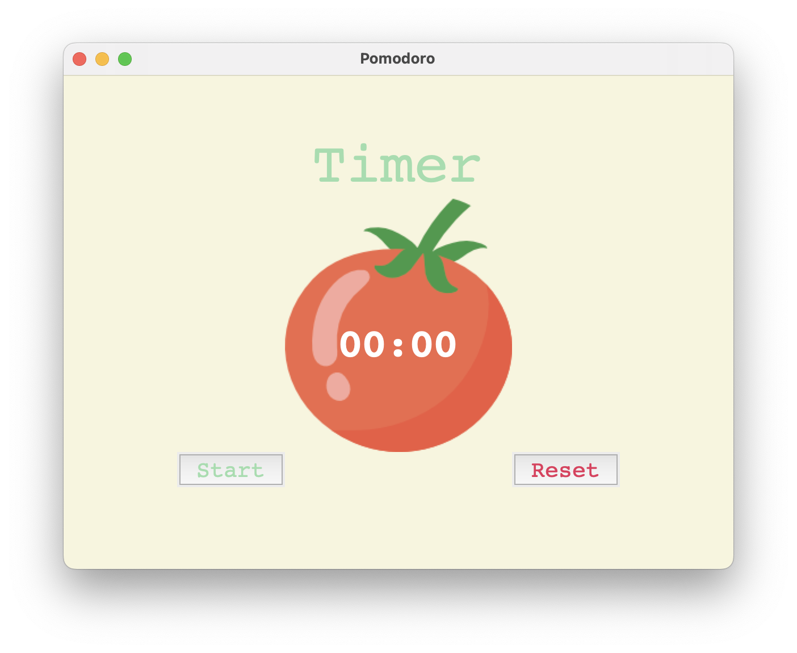

## Documentación del método Pomodoro App
El **Método Pomodoro** es una técnica de gestión del tiempo que se utiliza para mejorar la productividad y la concentración en el trabajo o estudio. Consiste en dividir el tiempo en bloques de trabajo de 25 minutos (conocidos como "pomodoros"), seguidos de descansos cortos de 5 minutos. Después de cuatro bloques de trabajo, se toma un descanso más largo de 20 minutos. El objetivo es aprovechar al máximo el tiempo de trabajo y minimizar las distracciones para mejorar la calidad y cantidad del trabajo realizado.

### Uso del código
El código que se presenta aquí es una implementación del Método Pomodoro en Python, utilizando la biblioteca Tkinter para crear una interfaz gráfica de usuario. Para ejecutar el archivo, se deben seguir los siguientes pasos:

1. Clonar el repositorio en una carpeta local.
[ https://github.com/abdielLopezpy/pomodoro-start.git
]
2. A través de la terminal, ubicarse en la carpeta donde se clonó el repositorio.
3. Instalar las dependencias necesarias ejecutando el comando `pipenv install`. 
4. Ejecutar el archivo principal `main.py` utilizando el comando `pipenv run python main.py`.
5. Se abrirá la ventana de la aplicación Pomodoro, donde se pueden iniciar y detener los temporizadores y realizar los descansos correspondientes.

### El código utiliza la biblioteca tkinter para crear la interfaz gráfica de usuario y consta de las siguientes partes:

## Constantes
* `PINK`: Constante que representa el color rosa utilizado en la interfaz de usuario.
* `RED`: Constante que representa el color rojo utilizado en la interfaz de usuario.
* `GREEN`: Constante que representa el color verde utilizado en la interfaz de usuario.
* `YELLOW`: Constante que representa el color amarillo utilizado en la interfaz de usuario.
* `FONT_NAME`: Constante que representa el nombre de la fuente utilizada en la interfaz de usuario.
* `WORK_MIN`: Constante que representa el número de minutos para un pomodoro de trabajo.
* `SHORT_BREAK_MIN`: Constante que representa el número de minutos para un descanso corto.
* `LONG_BREAK_MIN`: Constante que representa el número de minutos para un descanso largo.
* `reps`: Variable global que lleva la cuenta del número de pomodoros completados.
* `timer`: Variable que almacena el temporizador.

## Funciones

* `reset_timer()`: Función que se encarga de reiniciar el temporizador y establecer la interfaz de usuario en su estado inicial.
* `start_timer()`: Función que inicia el temporizador y cambia la interfaz de usuario en función del estado actual (trabajo, descanso corto, descanso largo).
* `count_down(count)`: Función que cuenta hacia abajo el tiempo restante del temporizador y actualiza la interfaz de usuario con el tiempo restante.
* `play_sound()`: Función que se encarga de reproducir un sonido cuando el temporizador llega a cero.

## Interfaz de Usuario

* `window`: La ventana principal de la aplicación.
* `title_label`: Una etiqueta que muestra el estado actual del temporizador (trabajo, descanso corto, descanso largo).
* `canvas`: Un elemento gráfico que muestra una imagen de un tomate y el tiempo restante del temporizador.
* `start_button`: Un botón que inicia el temporizador.
* `reset_button`: Un botón que reinicia el temporizador y restablece la interfaz de usuario.
* `check_marks`: Una etiqueta que muestra los marcadores de verificación que indican cuántos pomodoros se han completado.

